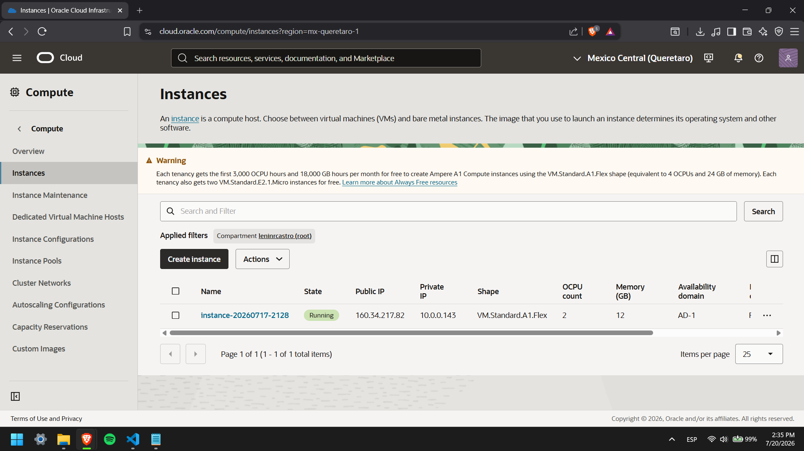
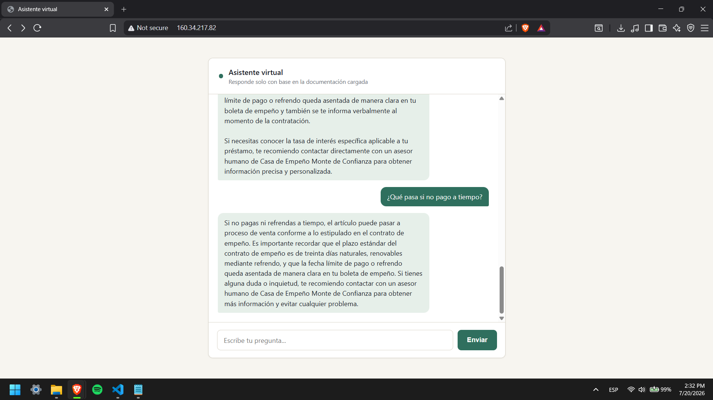

# Casa de Empeño Monte de Confianza — Chatbot RAG

Agente de IA que responde preguntas sobre **Casa de Empeño Monte de
Confianza**, construido con LangChain + Groq + FAISS como proyecto de
curso, usando únicamente herramientas gratuitas.

Servidor: http://160.34.217.82/

## Stack

| Componente | Tecnología |
|---|---|
| LLM | Groq — `llama-3.3-70b-versatile` (API gratuita) |
| Embeddings | `all-MiniLM-L6-v2` (`sentence-transformers`, local) |
| Vector store | FAISS (persistido en disco) |
| Orquestación | LangChain (`create_retrieval_chain` + `create_stuff_documents_chain`) |
| Servidor web | Flask |
| Fuente de datos | PDF y Excel dentro de `knowledge_base/` |

## Estructura

```
Proyecto_Agente_Groq/
├── ingest.py                  ← carga PDF/Excel, los fragmenta y construye el índice FAISS
├── chatbot.py                 ← lógica del agente (LangChain + Groq) + servidor Flask (--web)
├── chat.html                  ← interfaz de chat pública (la sirve chatbot.py --web)
├── knowledge_base/             ← PDF y Excel con la información real de la casa de empeño
├── vectorstore/                 ← índice vectorial (generado por ingest.py, no se sube al repo)
├── temp/
│   └── .env                     ← variables de entorno (no se sube al repo)
├── .env.example
├── .gitignore
├── requirements.txt
```

## Setup

```bash
# 1. Clonar y entrar a la carpeta
git clone https://github.com/lenin-ux/Proyecto_Agente_Groq.git
cd Proyecto_Agente_Groq

# 2. Crear entorno virtual
python -m venv venv
venv\Scripts\activate        # Windows PowerShell / CMD
# source venv/bin/activate   # Linux / Mac

# 3. Instalar dependencias
pip install -r requirements.txt

# 4. Crear el .env con la API key (dentro de temp/, no en la raíz)
mkdir temp
copy .env.example temp\.env      # Windows
# cp .env.example temp/.env      # Linux / Mac
# abrir temp/.env y pegar GROQ_API_KEY=gsk_...

# 5. Colocar los documentos reales de la empresa en knowledge_base/
#    (PDF y/o Excel)

# 6. Indexar los documentos (solo la primera vez, y cada vez que cambien)
python ingest.py

# 7. Levantar el chatbot
python chatbot.py            # modo terminal
python chatbot.py --web      # modo navegador → http://localhost:5000
```

## Deploy en producción

El agente está desplegado en **OCI Compute** (Ubuntu, Always Free),
con Nginx como reverse proxy en el puerto 80 y `systemd` manteniendo
el servicio siempre activo:

| | |
|---|---|
| **Servidor** | `http://160.34.217.82` |
| **Chat** | `http://160.34.217.82` (interfaz servida directamente en la raíz) |

> Si al abrir el link el navegador no carga nada, prueba escribiendo
> la URL completa con `http://` explícito — algunos navegadores
> (Chrome, Brave) autocompletan `https://` por defecto, y el servidor
> no tiene certificado SSL configurado (ver "Lecciones aprendidas").

### Pasos del deploy en OCI

**1. Crear la instancia**
- OCI Compute → Ubuntu → shape Always Free (`VM.Standard.A1.Flex`)
- Descargar la clave SSH **en el momento** en que se crea la instancia (no reutilizar una de un intento anterior — ver lecciones aprendidas)

**2. Abrir los puertos 80 y 5000**
- Networking → Virtual Cloud Networks → Security List
- Agregar Ingress Rules: Source `0.0.0.0/0`, TCP, puertos `80` y `5000`

**3. Clonar el repo y crear el entorno virtual**
```bash
git clone https://github.com/lenin-ux/Proyecto_Agente_Groq.git
cd Proyecto_Agente_Groq
python3 -m venv venv
source venv/bin/activate
```

**4. Instalar dependencias**
```bash
pip install -r requirements.txt
```

**5. Configurar el `.env` dentro de `temp/`**
```bash
mkdir temp
cp .env.example temp/.env
nano temp/.env   # pegar GROQ_API_KEY real
```

**6. Indexar los documentos**
```bash
python ingest.py
```

**7. Configurar el servicio systemd**
```bash
sudo tee /etc/systemd/system/chatbot.service << 'EOF'
[Unit]
Description=Chatbot LangChain + Groq
After=network.target

[Service]
User=ubuntu
WorkingDirectory=/home/ubuntu/Proyecto_Agente_Groq
ExecStart=/home/ubuntu/Proyecto_Agente_Groq/venv/bin/python chatbot.py --web
Restart=always
EnvironmentFile=/home/ubuntu/Proyecto_Agente_Groq/temp/.env

[Install]
WantedBy=multi-user.target
EOF
sudo systemctl daemon-reload
sudo systemctl enable chatbot
sudo systemctl start chatbot
```

**8. Abrir los puertos en iptables**

OCI Ubuntu bloquea por defecto todo tráfico entrante excepto el
puerto 22, además del firewall de la consola. Hay que abrir el
puerto también a nivel de sistema operativo:
```bash
sudo iptables -I INPUT -p tcp --dport 5000 -j ACCEPT
sudo iptables -I INPUT -p tcp --dport 80 -j ACCEPT
sudo netfilter-persistent save
```

**9. Configurar Nginx como reverse proxy (puerto 80)**
```bash
sudo apt install -y nginx
sudo tee /etc/nginx/sites-available/chatbot << 'EOF'
server {
    listen 80;
    server_name _;

    location / {
        proxy_pass http://127.0.0.1:5000;
        proxy_set_header Host $host;
        proxy_set_header X-Real-IP $remote_addr;
    }
}
EOF
sudo ln -s /etc/nginx/sites-available/chatbot /etc/nginx/sites-enabled/
sudo rm -f /etc/nginx/sites-enabled/default
sudo nginx -t
sudo systemctl restart nginx
```





## Uso

### Modo terminal
```bash
python chatbot.py
# Tú: ¿cuál es la tasa de interés mensual?
```

### Modo navegador / API
```
POST http://160.34.217.82/chat
Content-Type: application/json

{"pregunta": "¿Qué necesito para empeñar un artículo?"}
```

```json
{
  "respuesta": "Para empeñar un artículo necesitas presentar una identificación oficial vigente..."
}
```

## Ejemplos de respuestas

**¿Qué documentos necesito para empeñar algo?**
> *Para empeñar un artículo en Casa de Empeño Monte de Confianza, necesitas presentar una identificación oficial vigente, como credencial para votar, pasaporte o cédula profesional. Además, debes presentar el artículo que deseas empeñar en buen estado de funcionamiento y, en su caso, los accesorios o documentación que acrediten su autenticidad, como facturas, certificados o cajas originales.*

**¿Cuál es la tasa de interés y el plazo para recuperar un artículo?**
> *La taza de interes es del 16% por ciento mensualmente*

**¿Qué pasa si no pago a tiempo?**
> *Si no pagas ni refrendas a tiempo, el artículo puede pasar a proceso de venta conforme a lo estipulado en el contrato de empeño. Es importante recordar que el plazo estándar del contrato de empeño es de treinta días naturales, renovables mediante refrendo, y que la fecha límite de pago o refrendo queda asentada de manera clara en tu boleta de empeño. Si tienes alguna duda o inquietud, te recomiendo contactar con un asesor humano de Casa de Empeño Monte de Confianza para obtener más información y evitar cualquier problema.*

## Lecciones aprendidas

Desafíos reales encontrados durante el desarrollo y el despliegue, y
cómo se resolvieron:

| Problema | Solución |
|---|---|
| **Capacidad agotada en OCI** (`Out of capacity for shape VM.Standard.A1.Flex`) | La región de Querétaro solo tiene un Availability Domain; hubo que reintentar y/o ajustar los recursos solicitados hasta conseguir capacidad |
| **Doble firewall** | OCI bloquea tráfico tanto a nivel de red (Security List) como a nivel de sistema operativo (`iptables`). Hubo que abrir cada puerto (5000 y luego 80) en **ambos** lugares por separado |
| **API key de Groq inválida sin razón aparente** | Una clave copiada manualmente puede arrastrar espacios o caracteres invisibles; se resolvió generando una clave nueva desde la consola de Groq y copiándola con el botón de copiar, no seleccionando el texto a mano |
| **Puerto 5000 "ya en uso"** | Había una instancia anterior de `chatbot.py --web` corriendo en otra sesión SSH sin cerrar; se identificó y terminó el proceso con `lsof -i :5000` + `kill` |
| **El navegador no abría la URL sin `https`** | Chrome/Brave autocompletan `https://` automáticamente; el servidor solo tiene `http://` configurado (sin certificado SSL). Se resolvió confirmando que Edge sí abría bien, y avisando la URL completa con `http://` explícito |

## Cómo funciona

```
Pregunta del usuario
       ↓
  Flask "/chat" (chatbot.py --web)
       ↓
  Retriever FAISS  →  busca los 4 fragmentos más relevantes en vectorstore/
       ↓
  Prompt con contexto + reglas de comportamiento
       ↓
     Groq (llama-3.3-70b-versatile)  →  genera la respuesta en español
       ↓
     Respuesta
```

El sistema usa RAG (Retrieval-Augmented Generation): en vez de
responder desde el conocimiento general del modelo, Groq responde
únicamente con la información recuperada de la documentación de la
casa de empeño. Si la respuesta no está en los documentos, el
chatbot lo dice explícitamente y sugiere contactar a un asesor
humano, en vez de inventar información.

## Personalizar el comportamiento

Todo el "carácter" del bot se controla en `chatbot.py`, en la
variable `PROMPT_COMPORTAMIENTO`: nombre de la empresa, idioma y
tono, qué temas evitar, y qué hacer cuando no encuentra la respuesta
en el contexto.

## Notas sobre límites gratuitos

- Groq tiene límites de solicitudes por minuto/día en su nivel
  gratuito.
- El modelo de embeddings se descarga una sola vez (~90 MB) y queda
  en caché local — no vuelve a descargarse ni consume ninguna API.